# Backend Architecture - Complete Explanation

## 🏗️ What We Deployed

### **Overview:**
We deployed a **FastAPI-based backend** that acts as a **secure proxy** between your frontend and Azure Dynamic Sessions. It handles authentication, request routing, and code execution orchestration.

---

## 📦 Deployed Components

### **1. Backend Container App** (Currently DELETED)
- **Name**: `ai-ta-ra-coding-engine`
- **Technology**: FastAPI (Python web framework)
- **Purpose**: Public API gateway for code execution
- **URL**: `https://ai-ta-ra-coding-engine.happypond-428960e8.eastus2.azurecontainerapps.io`
- **Status**: ❌ Deleted (to save costs)

### **2. Backend Docker Image** (Stored in ACR)
- **Name**: `backend-image:v1`
- **Location**: `aitaraacr1763805702.azurecr.io/backend-image:v1`
- **Size**: ~150 MB
- **Base**: Python 3.11 Slim
- **Status**: ✅ Available in ACR (ready to deploy)

---

## 🔍 Backend Code Structure

```
backend/
├── main.py          # FastAPI application entry point
├── executor.py      # Azure Dynamic Sessions integration
├── models.py        # Request/Response data models
├── requirements.txt # Python dependencies
└── Dockerfile       # Container build instructions
```

---

## 📝 How Each File Works

### **1. `backend/main.py` - The API Gateway**

```python
from fastapi import FastAPI
from fastapi.middleware.cors import CORSMiddleware
from models import ExecuteRequest, ExecuteResponse
from executor import execute_code_in_session

app = FastAPI()

# Enable CORS for frontend access
app.add_middleware(
    CORSMiddleware,
    allow_origins=["*"],
    allow_methods=["*"],
    allow_headers=["*"],
)

@app.get("/")
def health_check():
    return {"status": "healthy", "service": "Azure Dynamic Sessions Backend"}

@app.get("/api/v2/runtimes")
def get_runtimes():
    return {
        "runtimes": [
            {"language": "python", "version": "3.10.0"},
            {"language": "java", "version": "15.0.2"},
            {"language": "c++", "version": "10.2.0"}
        ]
    }

@app.post("/api/v2/execute", response_model=ExecuteResponse)
def execute_code(request: ExecuteRequest):
    return execute_code_in_session(request)
```

**What it does:**
- ✅ Exposes 3 endpoints: `/`, `/api/v2/runtimes`, `/api/v2/execute`
- ✅ Handles CORS (allows frontend from any domain to call it)
- ✅ Validates incoming requests using Pydantic models
- ✅ Delegates code execution to `executor.py`

---

### **2. `backend/executor.py` - The Brain**

```python
import os
import requests
from azure.identity import DefaultAzureCredential, ManagedIdentityCredential
from models import ExecuteRequest, ExecuteResponse

# Configuration
POOL_MANAGEMENT_ENDPOINT = os.getenv("POOL_MANAGEMENT_ENDPOINT")
AZURE_CLIENT_ID = os.getenv("AZURE_CLIENT_ID")
USE_LOCAL_EXECUTOR = os.getenv("USE_LOCAL_EXECUTOR", "false").lower() == "true"

def execute_code_in_session(request: ExecuteRequest) -> ExecuteResponse:
    # Check if we should use local mock mode
    if USE_LOCAL_EXECUTOR or not POOL_MANAGEMENT_ENDPOINT:
        return execute_locally(request)
    
    # Get Azure AD token using Managed Identity
    credential = ManagedIdentityCredential(client_id=AZURE_CLIENT_ID)
    token = credential.get_token("https://management.azure.com/.default")
    
    # Build request to Azure Dynamic Sessions
    session_url = f"{POOL_MANAGEMENT_ENDPOINT}/{request.language}/execute"
    headers = {
        "Authorization": f"Bearer {token.token}",
        "Content-Type": "application/json"
    }
    
    payload = {
        "properties": {
            "codeInputType": "inline",
            "executionType": "synchronous",
            "code": request.files[0].content
        }
    }
    
    # Execute code in session pool
    response = requests.post(session_url, headers=headers, json=payload)
    
    # Parse and return results
    result = response.json()
    return ExecuteResponse(
        run={
            "stdout": result.get("stdout", ""),
            "stderr": result.get("stderr", ""),
            "code": result.get("exitCode", 0)
        },
        language=request.language,
        version=request.version
    )

def execute_locally(request: ExecuteRequest):
    # Local mock mode for testing without Azure
    import subprocess
    
    if request.language != "python":
        return ExecuteResponse(
            run={"stdout": "", "stderr": "Only Python supported in local mode", "code": 1},
            language=request.language,
            version=request.version
        )
    
    # Execute Python code locally
    result = subprocess.run(
        ["python3", "-c", request.files[0].content],
        capture_output=True,
        text=True,
        timeout=5
    )
    
    return ExecuteResponse(
        run={
            "stdout": result.stdout,
            "stderr": result.stderr,
            "code": result.returncode
        },
        language=request.language,
        version=request.version
    )
```

**What it does:**
- ✅ Authenticates with Azure using **Managed Identity** (no passwords!)
- ✅ Gets an **Azure AD access token**
- ✅ Sends code to **Session Pool** for execution
- ✅ Handles responses and errors
- ✅ Includes **Local Mock Mode** for testing without Azure

---

### **3. `backend/models.py` - Data Validation**

```python
from pydantic import BaseModel
from typing import List, Optional

class CodeFile(BaseModel):
    name: str
    content: str

class ExecuteRequest(BaseModel):
    language: str
    version: str
    files: List[CodeFile]
    stdin: Optional[str] = ""
    args: Optional[List[str]] = []
    compile_timeout: Optional[int] = 10000
    run_timeout: Optional[int] = 3000
    compile_memory_limit: Optional[int] = -1
    run_memory_limit: Optional[int] = -1

class RunResult(BaseModel):
    stdout: str
    stderr: str
    code: int
    signal: Optional[str] = None

class ExecuteResponse(BaseModel):
    run: RunResult
    compile: Optional[RunResult] = None
    language: str
    version: str
```

**What it does:**
- ✅ Defines the structure of requests and responses
- ✅ Automatically validates incoming data
- ✅ Provides type hints for better code quality
- ✅ Matches the frontend's expected format

---

### **4. `backend/Dockerfile` - Container Build**

```dockerfile
FROM python:3.11-slim

WORKDIR /app

# Copy dependencies
COPY requirements.txt .
RUN pip install --no-cache-dir -r requirements.txt

# Copy application code
COPY . .

# Expose port
EXPOSE 8000

# Run the application
CMD ["uvicorn", "main:app", "--host", "0.0.0.0", "--port", "8000"]
```

**What it does:**
- ✅ Creates a lightweight container (~150 MB)
- ✅ Installs Python dependencies
- ✅ Runs the FastAPI app with Uvicorn (ASGI server)
- ✅ Exposes port 8000 for HTTP traffic

---

## 🔄 Complete Request Flow

### **Step-by-Step: User Submits Code**

```mermaid
sequenceDiagram
    participant User as 👤 User Browser
    participant Frontend as 🌐 Frontend<br/>(JavaScript)
    participant Backend as 🔧 Backend API<br/>(FastAPI)
    participant Azure as 🔐 Azure AD
    participant Pool as 🏊 Session Pool
    participant Session as 📦 Execution<br/>Container

    User->>Frontend: Click "Run Code"
    Frontend->>Frontend: Prepare JSON payload
    
    Note over Frontend: POST /api/v2/execute<br/>{<br/>  language: "python",<br/>  files: [{content: "print('hi')"}]<br/>}
    
    Frontend->>Backend: HTTP POST Request
    
    Backend->>Backend: Validate request (models.py)
    Backend->>Azure: Request access token<br/>(Managed Identity)
    Azure-->>Backend: Return JWT token
    
    Backend->>Pool: POST /python/execute<br/>Authorization: Bearer <token><br/>{code: "print('hi')"}
    
    Pool->>Pool: Check for available session
    
    alt Session Available
        Pool->>Session: Reuse existing session
    else No Session
        Pool->>Session: Create new session (3-5s)
    end
    
    Session->>Session: Execute code in sandbox
    Session->>Session: Capture stdout/stderr
    Session-->>Pool: Return results
    
    Pool-->>Backend: {stdout: "hi\n", exitCode: 0}
    Backend->>Backend: Format response (models.py)
    Backend-->>Frontend: JSON response
    
    Frontend->>Frontend: Parse and display
    Frontend-->>User: Show output in UI
```



---

## 🔐 Authentication Flow (Managed Identity)

### **How the Backend Authenticates:**

```
┌─────────────────────────────────────────────────────────┐
│  1. Backend Container App starts                       │
│     - Azure assigns Managed Identity                   │
│     - Identity: ai-ta-RA-identity                      │
│     - Client ID: b84aa8c6-8ade-47e6-9c8c-b8c9ac2264fa │
└─────────────────────────────────────────────────────────┘
                        ↓
┌─────────────────────────────────────────────────────────┐
│  2. User sends code execution request                  │
│     POST /api/v2/execute                               │
└─────────────────────────────────────────────────────────┘
                        ↓
┌─────────────────────────────────────────────────────────┐
│  3. Backend requests Azure AD token                    │
│     credential = ManagedIdentityCredential()           │
│     token = credential.get_token(...)                  │
└─────────────────────────────────────────────────────────┘
                        ↓
┌─────────────────────────────────────────────────────────┐
│  4. Azure AD validates identity                        │
│     - Checks: Is this identity authorized?             │
│     - Checks: Does it have "Session Executor" role?    │
│     - Returns: JWT token (valid for 1 hour)            │
└─────────────────────────────────────────────────────────┘
                        ↓
┌─────────────────────────────────────────────────────────┐
│  5. Backend calls Session Pool with token              │
│     Authorization: Bearer <JWT_TOKEN>                  │
│     POST /python/execute                               │
└─────────────────────────────────────────────────────────┘
                        ↓
┌─────────────────────────────────────────────────────────┐
│  6. Session Pool validates token                       │
│     - Verifies signature                               │
│     - Checks expiration                                │
│     - Checks role assignment                           │
│     - Executes code if authorized                      │
└─────────────────────────────────────────────────────────┘
```

**Key Benefits:**
- ✅ **No passwords stored** anywhere
- ✅ **Automatic token rotation** (Azure handles it)
- ✅ **Fine-grained permissions** (role-based access)
- ✅ **Audit trail** (all access logged)

---

## 🚀 What We Deployed to Azure

### **Deployment Process:**

```bash
# 1. Built the Docker image
az acr build \
  --registry aitaraacr1763805702 \
  --image backend-image:v1 \
  --file backend/Dockerfile \
  backend/
```

**What happened:**
- ✅ Copied `backend/` folder to Azure
- ✅ Built Docker image in Azure (not locally)
- ✅ Pushed image to Container Registry
- ✅ Image size: ~150 MB

```bash
# 2. Created the Container App
az containerapp create \
  --name ai-ta-ra-coding-engine \
  --resource-group ai-ta-2 \
  --environment ai-ta-RA-env \
  --image aitaraacr1763805702.azurecr.io/backend-image:v1 \
  --target-port 8000 \
  --ingress external \
  --user-assigned ai-ta-RA-identity \
  --env-vars "POOL_MANAGEMENT_ENDPOINT=..." "AZURE_CLIENT_ID=..."
```

**What happened:**
- ✅ Created a public HTTPS endpoint
- ✅ Assigned Managed Identity
- ✅ Configured environment variables
- ✅ Set up auto-scaling (1-5 replicas)
- ✅ Enabled external ingress (public access)

---

## 🔧 Environment Variables

The backend uses these environment variables:

| Variable | Value | Purpose |
|----------|-------|---------|
| `POOL_MANAGEMENT_ENDPOINT` | `https://ai-ta-ra-session-pool...` | Session Pool URL |
| `AZURE_CLIENT_ID` | `b84aa8c6-8ade-47e6-9c8c-b8c9ac2264fa` | Managed Identity ID |
| `USE_LOCAL_EXECUTOR` | `false` (default) | Enable local mock mode |

---

## 📊 Backend Scaling

### **Auto-Scaling Configuration:**

```
Min Replicas: 1
Max Replicas: 5

┌─────────────────────────────────────────────────────┐
│  Low Traffic (0-10 req/sec)                        │
│  ┌──────────┐                                      │
│  │ Replica 1│  ← Only 1 instance running           │
│  └──────────┘                                      │
│  Cost: ~$1.30/day                                  │
└─────────────────────────────────────────────────────┘

┌─────────────────────────────────────────────────────┐
│  Medium Traffic (10-50 req/sec)                    │
│  ┌──────────┐  ┌──────────┐  ┌──────────┐         │
│  │ Replica 1│  │ Replica 2│  │ Replica 3│         │
│  └──────────┘  └──────────┘  └──────────┘         │
│  Cost: ~$3.90/day                                  │
└─────────────────────────────────────────────────────┘

┌─────────────────────────────────────────────────────┐
│  High Traffic (50+ req/sec)                        │
│  ┌──────────┐  ┌──────────┐  ┌──────────┐         │
│  │ Replica 1│  │ Replica 2│  │ Replica 3│         │
│  └──────────┘  └──────────┘  └──────────┘         │
│  ┌──────────┐  ┌──────────┐                       │
│  │ Replica 4│  │ Replica 5│                       │
│  └──────────┘  └──────────┘                       │
│  Cost: ~$6.50/day                                  │
└─────────────────────────────────────────────────────┘
```

---

## 🎯 Key Features

### **1. Local Mock Mode**
For development without Azure:
```bash
export USE_LOCAL_EXECUTOR=true
uvicorn main:app --reload
```
- ✅ Executes Python code locally using `subprocess`
- ✅ No Azure credentials needed
- ✅ Fast testing during development

### **2. Error Handling**
```python
try:
    response = requests.post(session_url, headers=headers, json=payload)
    response.raise_for_status()
except requests.exceptions.HTTPError as e:
    if e.response.status_code == 403:
        return ExecuteResponse(
            run={"stdout": "", "stderr": "Forbidden: Check role assignment", "code": 1},
            language=request.language,
            version=request.version
        )
```

### **3. CORS Support**
Allows frontend from any domain to call the API:
```python
app.add_middleware(
    CORSMiddleware,
    allow_origins=["*"],  # In production, specify exact domains
    allow_methods=["*"],
    allow_headers=["*"],
)
```

---

## 📈 Performance Characteristics

| Metric | Value |
|--------|-------|
| **Cold Start** | 2-3 seconds (first request after scale-down) |
| **Warm Response** | 50-200 ms (excluding code execution time) |
| **Throughput** | 100-500 req/sec (depending on replicas) |
| **Memory Usage** | ~100 MB per replica |
| **CPU Usage** | ~0.1 vCPU per replica (idle) |

---

## 🔄 How to Redeploy

### **If you make changes to the backend:**

```bash
# 1. Rebuild the image
az acr build \
  --registry aitaraacr1763805702 \
  --image backend-image:v2 \
  --file backend/Dockerfile \
  backend/

# 2. Update the container app
az containerapp update \
  --name ai-ta-ra-coding-engine \
  --resource-group ai-ta-2 \
  --image aitaraacr1763805702.azurecr.io/backend-image:v2
```

---

## 🎓 Summary

### **What We Deployed:**
1. ✅ **FastAPI Backend** - Python web API
2. ✅ **Docker Image** - Containerized application
3. ✅ **Container App** - Azure-managed hosting
4. ✅ **Managed Identity** - Secure authentication
5. ✅ **Environment Variables** - Configuration

### **How It Works:**
1. User submits code via frontend
2. Backend receives request
3. Backend authenticates with Azure AD (Managed Identity)
4. Backend sends code to Session Pool
5. Session Pool executes code in isolated container
6. Results returned to user

### **Key Benefits:**
- ✅ **Secure**: No passwords, Managed Identity authentication
- ✅ **Scalable**: Auto-scales from 1 to 5 replicas
- ✅ **Cost-Effective**: Pay only for what you use
- ✅ **Maintainable**: Simple Python code, easy to update
- ✅ **Testable**: Local mock mode for development

---

**Created:** November 24, 2025  
**Status:** Backend image stored in ACR, Container App deleted (to save costs)  
**Ready to deploy:** Run `./manage_resources.sh start-backend`
