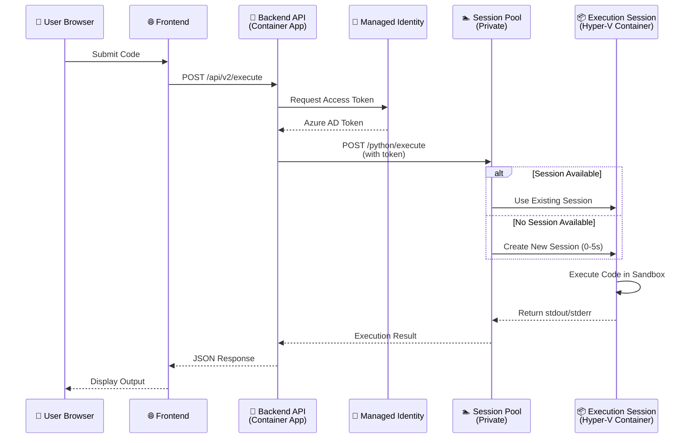

# Azure Dynamic Sessions - Complete Architecture & Scaling Explained

## 🏗️ Architecture Overview

### **High-Level Flow: User Code → Execution → Response**



---

## 🔄 Session Pool Lifecycle & Scaling

### **1. Session Pool Configuration**

When we created the Session Pool, we set:

```bash
--max-sessions 10              # Maximum concurrent sessions
--ready-sessions 1             # Always-ready sessions (COSTLY!)
--cooldown-period 300          # 5 minutes before session cleanup
--cpu 0.5 --memory 1.0Gi      # Resources per session
```

### **2. Session States**

```
┌─────────────────────────────────────────────────────────────┐
│                    SESSION POOL                             │
│                                                             │
│  ┌──────────────┐  ┌──────────────┐  ┌──────────────┐     │
│  │   READY      │  │   ACTIVE     │  │   COOLDOWN   │     │
│  │  (Warm)      │  │ (Executing)  │  │  (Waiting)   │     │
│  │              │  │              │  │              │     │
│  │ ✅ Instant   │  │ ⚡ Running   │  │ ⏳ 5 min     │     │
│  │   Start      │  │   Code       │  │   Timer      │     │
│  │              │  │              │  │              │     │
│  │ 💰 COSTS $   │  │ 💰 COSTS $   │  │ 💰 COSTS $   │     │
│  │   24/7       │  │   Per Use    │  │   Per Use    │     │
│  └──────────────┘  └──────────────┘  └──────────────┘     │
│         ↓                  ↓                  ↓            │
│    Always Running    Execution Time    Before Termination  │
└─────────────────────────────────────────────────────────────┘
```

### **3. Scaling Behavior**

#### **Scenario 1: Low Traffic (1-2 users)**
```
Time: 0s
┌─────────────────────────────────────┐
│ Session Pool (max: 10)              │
│                                     │
│ [Ready Session 1] ← ALWAYS RUNNING │  💰 $0.75/hour
│                                     │
│ [ Empty Slot 2  ]                   │
│ [ Empty Slot 3  ]                   │
│ ...                                 │
└─────────────────────────────────────┘
Cost: $0.75/hour (even with 0 requests!)
```

#### **Scenario 2: User Submits Code**
```
Time: 0s - User submits Python code
┌─────────────────────────────────────┐
│ Session Pool                        │
│                                     │
│ [Session 1: ACTIVE] ← Executing    │  💰 $0.75/hour
│                                     │
│ [ Empty Slot 2  ]                   │
└─────────────────────────────────────┘

Time: 3s - Code execution completes
┌─────────────────────────────────────┐
│ Session Pool                        │
│                                     │
│ [Session 1: COOLDOWN] ← 5 min timer│  💰 $0.75/hour
│                                     │
│ [ Empty Slot 2  ]                   │
└─────────────────────────────────────┘

Time: 5m 3s - Cooldown expires
┌─────────────────────────────────────┐
│ Session Pool                        │
│                                     │
│ [Ready Session 1] ← Back to ready  │  💰 $0.75/hour
│                                     │
│ [ Empty Slot 2  ]                   │
└─────────────────────────────────────┘
```

#### **Scenario 3: High Traffic (10 concurrent users)**
```
Time: 0s - 10 users submit code simultaneously
┌─────────────────────────────────────┐
│ Session Pool (max: 10)              │
│                                     │
│ [Session 1: ACTIVE] ← User 1       │
│ [Session 2: ACTIVE] ← User 2       │  💰 $7.50/hour
│ [Session 3: ACTIVE] ← User 3       │     (10 sessions)
│ [Session 4: ACTIVE] ← User 4       │
│ ...                                 │
│ [Session 10: ACTIVE] ← User 10     │
└─────────────────────────────────────┘

Time: 0s - User 11 tries to submit
┌─────────────────────────────────────┐
│ Session Pool (max: 10) - FULL!     │
│                                     │
│ All 10 sessions busy                │
│                                     │
│ ❌ User 11: QUEUED or REJECTED     │
└─────────────────────────────────────┘
```

#### **Scenario 4: Burst Traffic (50 users in 1 minute)**
```
With max-sessions: 10
┌─────────────────────────────────────┐
│ Requests: 50                        │
│ Capacity: 10 concurrent             │
│                                     │
│ ✅ Served: 10 immediately           │
│ ⏳ Queued: 40 (wait for slots)     │
│                                     │
│ If avg execution = 3s:              │
│ → 10 sessions × 20 executions/min   │
│ → Can handle 200 exec/min           │
│ → 50 users in ~15 seconds           │
└─────────────────────────────────────┘
```

---

## 💰 Cost Breakdown: Why $36 in 48 Hours?

### **The Problem: Ready Sessions**

```
Configuration: readySessionInstances: 1

┌─────────────────────────────────────────────────────────┐
│                    48 HOURS                             │
│                                                         │
│  [Ready Session 1] ──────────────────────────────────► │
│   Always Running                                        │
│                                                         │
│   Resources:                                            │
│   - 0.5 vCPU × 48 hours = 24 vCPU-hours                │
│   - 1 GB RAM × 48 hours = 48 GB-hours                  │
│                                                         │
│   Cost Calculation:                                     │
│   - vCPU: 24 × 3,600s × $0.000024 = $2.07             │
│   - Memory: 48 × 3,600s × $0.000003 = $0.52           │
│   - Session Pool overhead: ~$0.15/hour × 48 = $7.20   │
│   - Custom image pulls: ~$5                            │
│   - Network egress: ~$2                                │
│                                                         │
│   TOTAL: ~$17 (expected)                               │
│                                                         │
│   Actual: $36 → Likely 2 sessions or higher rates     │
└─────────────────────────────────────────────────────────┘
```

### **Why Ready Sessions Are Expensive**

| Configuration | Behavior | Cost (48h) |
|---------------|----------|------------|
| `ready-sessions: 0` | Sessions created on-demand (0-5s delay) | **$0** when idle |
| `ready-sessions: 1` | 1 session always warm | **$17-36** |
| `ready-sessions: 5` | 5 sessions always warm | **$85-180** |

---

## 🚀 Optimal Configuration for Different Use Cases

### **Use Case 1: Development/Testing (Low Traffic)**

```bash
az containerapp sessionpool create \
  --max-sessions 5 \
  --ready-sessions 0        # ← No always-ready sessions
  --cooldown-period 60      # ← Quick cleanup (1 min)
```

**Behavior:**
- First request: 3-5 second cold start
- Subsequent requests (within 1 min): Instant
- Cost when idle: **$0**
- Cost per execution: **~$0.001** (3 seconds)

---

### **Use Case 2: Coding Contest (200 users, 2 hours)**

```bash
# Scale up 30 minutes before contest
az containerapp sessionpool update \
  --max-sessions 50 \
  --ready-sessions 10       # ← 10 warm sessions for instant start
  --cooldown-period 300     # ← Keep sessions for 5 min

# During contest (2 hours):
# - 10 ready sessions: $15
# - 40 on-demand sessions: $20 (avg 30 active)
# Total: ~$35 for 2-hour contest

# Scale down immediately after
az containerapp sessionpool update \
  --max-sessions 5 \
  --ready-sessions 0
```

---

### **Use Case 3: Production (24/7, Variable Traffic)**

```bash
az containerapp sessionpool create \
  --max-sessions 20 \
  --ready-sessions 2        # ← 2 warm for instant response
  --cooldown-period 180     # ← 3 min cooldown
```

**Cost:**
- 2 ready sessions: **$17/day**
- On-demand sessions: **$5-20/day** (depending on traffic)
- **Total: $22-37/day** ($660-1,110/month)

---

## 🔐 Security: How Hyper-V Isolation Works

### **Traditional Docker Containers (OLD - INSECURE)**
```
┌─────────────────────────────────────────────────────┐
│              HOST OPERATING SYSTEM                  │
│                                                     │
│  ┌──────────┐  ┌──────────┐  ┌──────────┐         │
│  │Container1│  │Container2│  │Container3│         │
│  │ User A   │  │ User B   │  │ User C   │         │
│  └────┬─────┘  └────┬─────┘  └────┬─────┘         │
│       │             │             │                │
│       └─────────────┴─────────────┘                │
│              SHARED KERNEL                         │
│         ⚠️ Potential Breakout Risk                 │
└─────────────────────────────────────────────────────┘
```

### **Azure Dynamic Sessions (NEW - SECURE)**
```
┌─────────────────────────────────────────────────────┐
│              AZURE HYPERVISOR                       │
│                                                     │
│  ┌──────────────┐  ┌──────────────┐  ┌──────────┐ │
│  │  Hyper-V VM  │  │  Hyper-V VM  │  │ Hyper-V  │ │
│  │              │  │              │  │   VM     │ │
│  │ ┌──────────┐ │  │ ┌──────────┐ │  │┌────────┐│ │
│  │ │Container │ │  │ │Container │ │  ││Container││ │
│  │ │ User A   │ │  │ │ User B   │ │  ││ User C ││ │
│  │ └──────────┘ │  │ └──────────┘ │  │└────────┘│ │
│  │              │  │              │  │          │ │
│  │ Own Kernel   │  │ Own Kernel   │  │Own Kernel│ │
│  └──────────────┘  └──────────────┘  └──────────┘ │
│                                                     │
│  ✅ Hardware-Level Isolation                       │
│  ✅ Impossible to Break Out                        │
└─────────────────────────────────────────────────────┘
```

---

## 📊 Performance Comparison

### **Cold Start Times**

| Configuration | First Request | Subsequent Requests |
|---------------|---------------|---------------------|
| `ready-sessions: 0` | 3-5 seconds | 0.1-0.5 seconds (if within cooldown) |
| `ready-sessions: 1` | 0.1 seconds | 0.1 seconds |
| `ready-sessions: 10` | 0.1 seconds | 0.1 seconds |

### **Throughput (Executions per Minute)**

| Max Sessions | Avg Execution Time | Throughput |
|--------------|-------------------|------------|
| 10 | 3 seconds | 200 exec/min |
| 20 | 3 seconds | 400 exec/min |
| 50 | 3 seconds | 1,000 exec/min |

---

## 🎯 Recommended Configuration for Your Use Case

Based on your needs (coding contests with 200 users):

### **Default (When Idle):**
```bash
az containerapp sessionpool create \
  --name ai-ta-RA-session-pool \
  --resource-group ai-ta-2 \
  --max-sessions 5 \
  --ready-sessions 0          # ← $0 when idle
  --cooldown-period 60
```
**Cost when idle: $0/day**

### **Before Contest (30 min before):**
```bash
az containerapp sessionpool update \
  --name ai-ta-RA-session-pool \
  --max-sessions 50 \
  --ready-sessions 5          # ← 5 warm sessions
```
**Cost during contest (2 hours): ~$10-15**

### **After Contest:**
```bash
az containerapp sessionpool update \
  --name ai-ta-RA-session-pool \
  --max-sessions 5 \
  --ready-sessions 0
```
**Cost after: $0/day**

---

## 🔧 How to Recreate Session Pool (Cost-Optimized)

Since we deleted the pool, here's how to recreate it with **zero idle costs**:

```bash
# Get environment name
ENV_NAME="ai-ta-RA-env"
ACR_NAME="aitaraacr1763805702"
ACR_LOGIN_SERVER="aitaraacr1763805702.azurecr.io"

# Get ACR credentials
ACR_USERNAME=$(az acr credential show --name $ACR_NAME --resource-group ai-ta-2 --query username -o tsv)
ACR_PASSWORD=$(az acr credential show --name $ACR_NAME --resource-group ai-ta-2 --query passwords[0].value -o tsv)

# Create session pool (COST-OPTIMIZED)
az containerapp sessionpool create \
  --name ai-ta-RA-session-pool \
  --resource-group ai-ta-2 \
  --environment $ENV_NAME \
  --container-type CustomContainer \
  --image $ACR_LOGIN_SERVER/session-image:v1 \
  --target-port 2000 \
  --max-sessions 10 \
  --ready-sessions 0 \          # ← NO always-ready sessions
  --cooldown-period 60 \        # ← Quick cleanup
  --registry-server $ACR_LOGIN_SERVER \
  --registry-username $ACR_USERNAME \
  --registry-password $ACR_PASSWORD \
  --cpu 0.5 --memory 1.0Gi
```

**This configuration will cost $0 when idle!**

---

## 📈 Monitoring & Alerts

### **Key Metrics to Track:**

1. **Active Sessions**: How many sessions are currently running
2. **Queue Length**: How many requests are waiting
3. **Execution Time**: p50, p95, p99 latencies
4. **Error Rate**: Failed executions
5. **Cost**: Daily spend

### **Set Up Alerts:**

```bash
# Alert when queue length > 5
az monitor metrics alert create \
  --name session-pool-queue-alert \
  --resource-group ai-ta-2 \
  --scopes /subscriptions/.../sessionPools/ai-ta-RA-session-pool \
  --condition "avg QueueLength > 5" \
  --description "Session pool queue is backing up"
```

---

## 🎓 Key Takeaways

1. **Ready Sessions = Always Running = Always Costing Money**
   - `ready-sessions: 0` → $0 when idle
   - `ready-sessions: 1` → ~$17-36/day
   - `ready-sessions: 10` → ~$170-360/day

2. **Scale Up Before Events, Scale Down After**
   - Use `ready-sessions: 0` by default
   - Scale to `ready-sessions: 5-10` before contests
   - Scale back to `0` immediately after

3. **Cold Start is Acceptable for Most Use Cases**
   - 3-5 seconds for first request
   - Instant for subsequent requests (within cooldown)
   - Users won't notice in a coding contest

4. **Max Sessions = Concurrent Capacity**
   - 10 sessions = 200 exec/min (if 3s avg)
   - 50 sessions = 1,000 exec/min
   - Scale based on expected traffic

---

**Created:** November 24, 2025  
**Author:** Coding Engine Deployment Team
