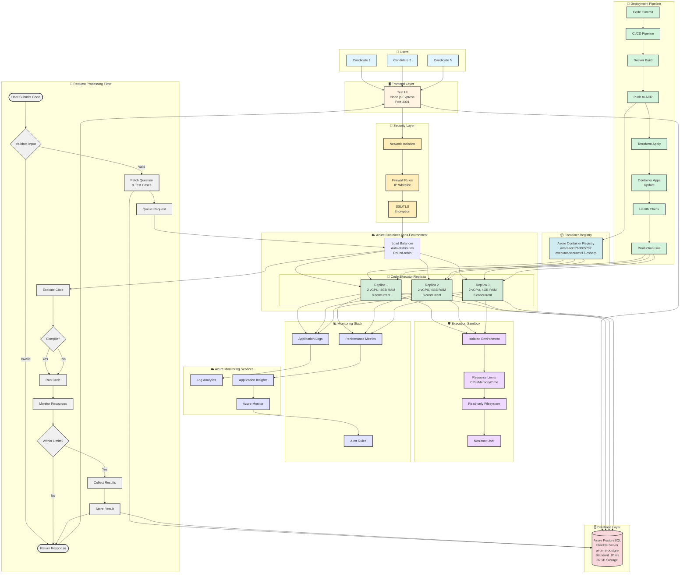

# 🏗️ Complete Architecture Diagram - Coding Engine

## 📊 Single Comprehensive Mermaid Diagram

---

## 📋 Component Details

### 1. Users Layer
- **Candidates**: Multiple users submitting code
- **Access**: Via web browser or API

### 2. Frontend Layer
- **Test UI**: Node.js Express server
- **Port**: 3001
- **Functions**: Question display, code submission, results

### 3. Security Layer
- **Network Isolation**: Private VNet (optional)
- **Firewall**: IP whitelist rules
- **SSL/TLS**: Encrypted connections

### 4. Container Apps
- **Load Balancer**: Built-in Azure load balancer
- **Replicas**: 1-3 auto-scaling replicas
- **Resources**: 2 vCPU, 4GB RAM each
- **Capacity**: 8 concurrent requests per replica

### 5. Execution Sandbox
- **Isolation**: Separate environment per execution
- **Resource Limits**: CPU, memory, time constraints
- **Filesystem**: Read-only access
- **User**: Non-root execution

### 6. Container Registry
- **ACR**: Azure Container Registry
- **Image**: `executor-secure:v17-csharp`
- **Versioning**: Tagged images

### 7. Database
- **PostgreSQL**: Azure Flexible Server
- **Storage**: 32GB
- **Backup**: 7 days retention

### 8. Monitoring
- **Logs**: Application logging
- **Metrics**: Performance data
- **Alerts**: Automated notifications

---

## 🔄 Data Flow Summary

1. **User** submits code via **Test UI**
2. **Test UI** validates and fetches question from **Database**
3. Request goes through **Security Layer** (Network → Firewall → SSL)
4. **Load Balancer** distributes to available **Replica**
5. **Replica** creates **Sandbox** environment
6. Code is compiled (if needed) and executed
7. Resources are **Monitored** during execution
8. Results are collected and stored in **Database**
9. Response returned to **User** via **Test UI**
10. **Monitoring** tracks all metrics and logs

---

## 📊 Resource Summary

| Component | Count | Resources | Location |
|-----------|-------|-----------|----------|
| **Users** | N | - | External |
| **Test UI** | 1 | Node.js | Local/Azure |
| **Replicas** | 1-3 | 2 vCPU, 4GB each | Azure Container Apps |
| **Database** | 1 | 1 vCore, 2GB, 32GB | Azure PostgreSQL |
| **Registry** | 1 | 10GB storage | Azure Container Registry |
| **Monitoring** | Multiple | - | Azure Monitor |

---

## 🎯 Key Features

✅ **Auto-scaling**: 1-3 replicas based on load  
✅ **Load Balancing**: Built-in Azure load balancer  
✅ **Security**: Multi-layer security (Network, Firewall, SSL, Sandbox)  
✅ **Monitoring**: Complete observability stack  
✅ **Database**: Persistent storage for questions and results  
✅ **Deployment**: Automated CI/CD pipeline  

---

**This diagram shows the complete architecture in one view!** 🎉

